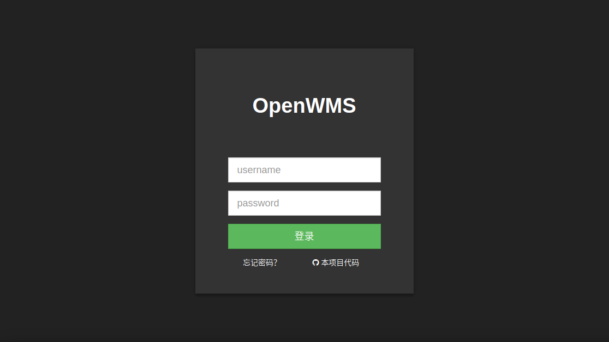
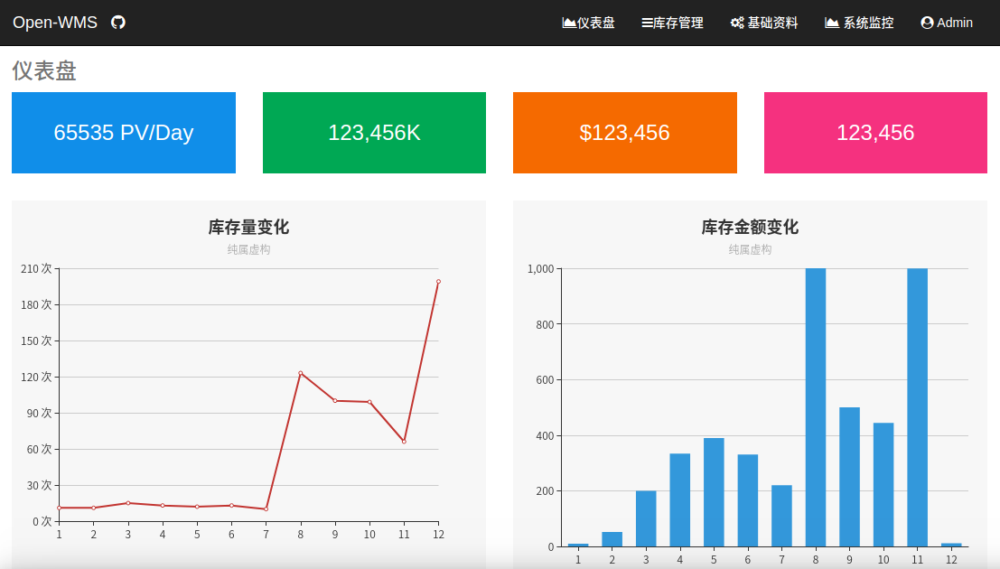
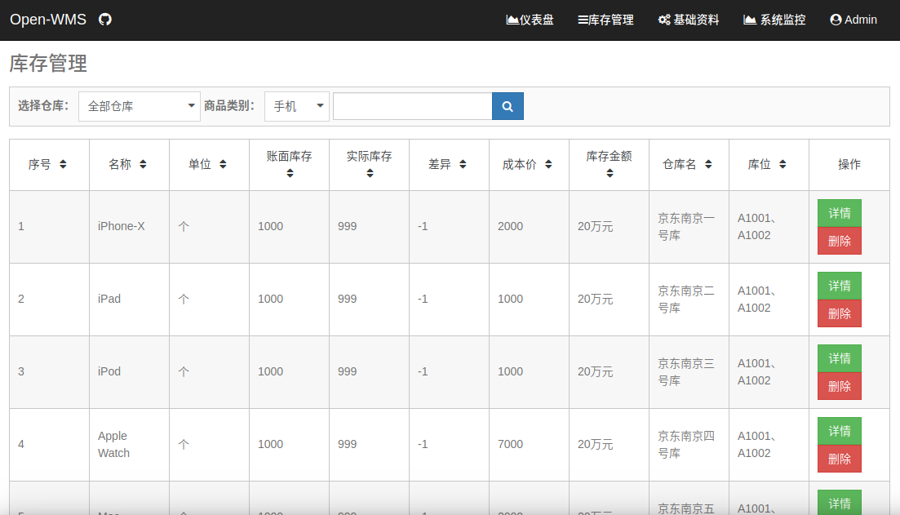

<a href="./README-cn.md" target="_blank">中文版 README</a>

## OpenWMS-Frontend

This is the front-end project of OpenWMS, based on Angular 6.0.0 and PrimeNG 5.2.4 .

### Demo Site

Demo site on Alibaba Cloud: http://47.104.80.251:4200

### Screenshots

### Evolution History

### Directory Structure

### Usage

For Chinese developers:

    Please fork this repo first
    git clone your-repo-url
    cd OpenWMS-Frontend
    npm i -g cnpm --registry=https://registry.npm.taobao.org
    cnpm i -g @angular/cli
    cnpm install
    ng serve --env=dev

For others:

    Please fork this repo first
    git clone your-repo-url
    cd OpenWMS-Frontend
    npm install
    ng serve --env=dev

Open your browser and visit http://localhost:4200/

### HMR Support

You don't want the browser to refresh the whole window when you modified some code, so we have HMR module.

@angular/cli doesn't support HRM by default, we have to handle this by ourselves, please refer to this article on Medium: https://medium.com/wizardnet972/hot-module-replacement-with-angular-cli-5fc7a3ae4a9c

In order to run this repo in HRM mode, please run this command:

    npm run hmr

**NOTE:**@angular/cli V6.x has integrated HMR support, so just run this in your terminal:

    ng serve --hmr

### Switching environment

There are three config files located in src/environments, named environment.dev.ts, environment.mock.ts, and environment.prod.ts.

"environment.dev.ts" will be used when no parameter was detected from your terminal, if you want to switch to other envirmont, try this:

    ng serve -e mock

### License

MIT

You can use this project whatever you want, there is no need to notify me in advance, because Chinese developers are always busy.

If you want more learning materials in Chinese, please visit this site: www.ngfans.net

### QQ Group

<a target="_blank" href="//shang.qq.com/wpa/qunwpa?idkey=e13f3165eba410049bc7fd145507ddaf15b5d543398cef62471f3922e1611cd1" class="list-group-item"><i class="fa fa-qq" aria-hidden="true"></i> Angular-OpenWMS</a>

If this repo is useful to you, please star it, thank you.
